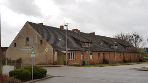

# Kommune Wilmersdorf e.V.
 
 

 
 

 
Wir sind der Kommune Wilmersdorf e.V. auch Kowi genannt. Gegründet Ende 2016 haben wir in Wilmersdorf bei Angermünde 2020 ein Grundstück erworben. Wir wollen hier in der ländlichen Uckermark einen Raum schaffen für Kultur, (Umwelt-)Bildung, Austausch und vieles mehr. Den Platz mitten im Dorf, in einiger Entfernung zu Berlin und dennoch mit Bus und Bahn gut angebunden, sehen wir als Chance. Hier können wir einen Ort kreieren, an dem sich Jung und Alt, Dorfbewohner und Städter:innen, Kulturinteressierte und Bastler treffen können, um gemeinsam zu lernen, bauen, musizieren, reden, Erfahrungen sammeln usw. Unser Vereinshaus, eine ehemalige Schnitterkaserne, befindet sich derzeit noch Umbau und soll nach und nach verschiedene Möglichkeiten bieten: Es werden Seminarräume für ökologische und politische Bildung geschaffen.   Werkstätten z. B. für Holzarbeiten und Fahrradreparaturen werden eingerichtet. Zusätzlich sollen Gästeunterkünfte Übernachtungsmöglichkeit etwa für Seminarteilnehmenden und Schulklassen entstehen, außerdem Veranstaltungsräume für Lesungen, Konzerte, Kino und Theater. Der große Naturgarten bietet Raum für Seminare zur theoretischen und praktischen Umweltbildung sowie für erlebnispädagogische Aktionen. Im Tauschladen können Produkte aus den Gärten der Dorfbewohner*innen gegen andere Güter getauscht werden. Dabei legen wir großen Wert auf nachhaltiges Bauen und umweltfreundliche Praktiken wie Solarenergie, Recycling und Permakultur. Das Wissen um die Techniken teilen wir jetzt schon im Rahmen von Wochenendworkshops.  
Derzeit besteht unser Verein aus elf Mitgliedern mit einem breiten Unterstützer*innenkreis. Wir kennen uns schon lange, haben zusammen gewohnt, gearbeitet und verschiedene Projekte und Veranstaltungen organisiert und umgesetzt. Zuletzt konnten wir zudem auch neue Menschen in unseren Reihen begrüßen, die unsere Vision teilen. Die meisten von uns sind auf dem Land großgeworden und kennen die Probleme und Schwierigkeiten, denen Menschen im ländlichen Raum gegenüberstehen. Der Mangel an kulturellen Angeboten und Perspektivlosigkeit waren der Grund, warum wir in die Stadt gezogen sind.   
 
